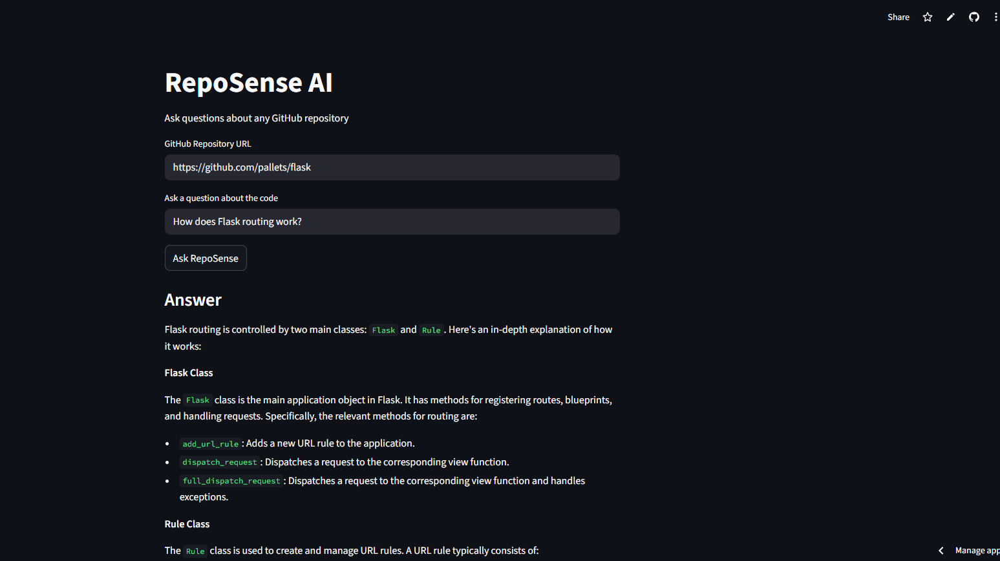

# Project Title

A brief description of what this project does and who it's for

# 🔍 RepoSense AI

### Ask natural language questions about any GitHub repository.

*Powered by RAG · Semantic Search · Llama-3 via Groq*


[**Live Demo**](https://reposense-ai.streamlit.app) ·
[**Live API**](https://reposense-ai.onrender.com/docs) ·

---
## Demo UI



## 🧠 What is RepoSense AI?

RepoSense AI is an intelligent codebase assistant that lets developers ask plain-English questions about any public GitHub repository — and get precise, context-aware answers.

It combines **Retrieval-Augmented Generation (RAG)**, **FAISS vector search**, and **Groq's ultra-fast Llama-3 inference** to understand large codebases without hallucinating details or losing context.

> Ask *"How does React implement hooks?"* — and get a real, code-grounded answer in seconds.

---

## ✨ Features

| Feature | Description |
|---|---|
| 🔗 **Any Public Repo** | Analyze any GitHub repository by URL |
| 💬 **Natural Language Q&A** | Ask questions in plain English, get code-grounded answers |
| 🔎 **Semantic Search** | TF-IDF vector embeddings + FAISS for fast, relevant retrieval |
| ⚡ **Blazing Fast LLM** | Groq-hosted Llama-3 for sub-second inference |
| 💾 **Cached Indexes** | Vector indexes persisted per repo — no re-indexing on repeat queries |
| 🚀 **Scalable API** | FastAPI backend, ready for production deployment |

---

## 🏗 System Architecture

```
┌─────────────────────────────────────────────────────────────────────┐
│                         RepoSense AI Pipeline                       │
│                                                                     │
│  ┌──────────┐    ┌──────────────┐    ┌────────────────────────┐    │
│  │  GitHub  │───▶│  GitPython   │───▶│   File Chunker         │    │
│  │   Repo   │    │  (Clone)     │    │   (Filter + Split)     │    │
│  └──────────┘    └──────────────┘    └───────────┬────────────┘    │
│                                                  │                  │
│                                                  ▼                  │
│  ┌──────────────────────────────────────────────────────────────┐  │
│  │                     Vector Pipeline                          │  │
│  │                                                              │  │
│  │   Code Chunks ──▶ TF-IDF Embeddings ──▶ FAISS Index         │  │
│  │                                              │               │  │
│  │                        User Query ──▶ Query Vector          │  │
│  │                                              │               │  │
│  │                              Top-K Relevant Chunks ◀────────┘  │
│  └───────────────────────────────┬──────────────────────────────┘  │
│                                  │                                  │
│                                  ▼                                  │
│  ┌───────────────────────────────────────────────────────────────┐ │
│  │                     LLM Layer (Groq)                          │ │
│  │                                                               │ │
│  │   System Prompt + Retrieved Context + User Question          │ │
│  │                        │                                     │ │
│  │                        ▼                                     │ │
│  │              Llama-3 → Final Answer                          │ │
│  └───────────────────────────────────────────────────────────────┘ │
└─────────────────────────────────────────────────────────────────────┘
```

---

## ⚙️ Tech Stack

**Backend**
- **FastAPI** — async REST API
- **Python 3.10+**
- **Pydantic** — request/response validation
- **GitPython** — repo cloning

**AI / ML**
- **FAISS** — vector similarity search
- **TF-IDF** — code chunk embeddings
- **Groq API** — Llama-3 inference
- **RAG Pipeline** — context-grounded generation

**Infrastructure**
- **Uvicorn** — ASGI server
- **In-memory index cache** — per-repo persistence
- **File-based chunking** — language-aware splitting

---

## 🔄 How It Works

Each request flows through a fully automated RAG pipeline — from a GitHub URL to a precise, code-grounded answer:

```
                ┌──────────────────────┐
                │         User         │
                │  Ask question about  │
                │     GitHub repo      │
                └─────────┬────────────┘
                          │
                          ▼
                ┌──────────────────────┐
                │     FastAPI API      │
                │    /ask  endpoint    │
                └─────────┬────────────┘
                          │
                          ▼
                ┌──────────────────────┐
                │  Repository Loader   │
                │  Clone GitHub repo   │
                └─────────┬────────────┘
                          │
                          ▼
                ┌──────────────────────┐
                │   Code Processing    │
                │  Chunk + Filter Code │
                └─────────┬────────────┘
                          │
                          ▼
                ┌──────────────────────┐
                │  Embedding Pipeline  │
                │ TF-IDF Vectorization │
                └─────────┬────────────┘
                          │
                          ▼
                ┌──────────────────────┐
                │   Vector Database    │
                │     FAISS Index      │
                └─────────┬────────────┘
                          │
                          ▼
                ┌──────────────────────┐
                │  Retrieval Engine    │
                │ Semantic Code Search │
                └─────────┬────────────┘
                          │
                          ▼
                ┌──────────────────────┐
                │      Groq LLM        │
                │  Code Understanding  │
                └─────────┬────────────┘
                          │
                          ▼
                ┌──────────────────────┐
                │    AI Explanation    │
                │   Answer returned    │
                │       to user        │
                └──────────────────────┘
```

---

## 🚀 Quick Start

**Prerequisites**
- Python 3.10+
- A [Groq API key](https://console.groq.com) (free tier available)

**Installation**

```bash
# 1. Clone the repository
git clone https://github.com/IamAkram321/reposense-ai
cd repo-sense-ai

# 2. Install dependencies
pip install -r requirements.txt

# 3. Set your API key
set GROQ_API_KEY=your_key_here

# 4. Start the server
uvicorn app.main:app --reload
```

Open the interactive API docs at `http://127.0.0.1:8000/docs`

---

## 📡 API Reference

### `POST /ask`

Ask a natural language question about any public GitHub repository.

**Request**

```json
{
  "repo_url": "https://github.com/facebook/react",
  "question": "How does React implement hooks?"
}
```

**Response**

```json
{
  "answer": "React hooks are implemented primarily in packages/react/src/ReactHooks.js. The useState hook works by storing state inside the fiber node associated with the component. On the first render, mountState() initializes the hook queue; on subsequent renders, updateState() dispatches actions through the reducer...",
  "sources": [
    "packages/react/src/ReactHooks.js",
    "packages/react-reconciler/src/ReactFiberHooks.js"
  ]
}
```

**More examples**

```bash
# Understand a Django project's auth flow
curl -X POST http://localhost:8000/ask \
  -H "Content-Type: application/json" \
  -d '{"repo_url": "https://github.com/django/django", "question": "How does Django handle user authentication?"}'

# Explore a Go project's concurrency model
curl -X POST http://localhost:8000/ask \
  -H "Content-Type: application/json" \
  -d '{"repo_url": "https://github.com/golang/go", "question": "How are goroutines scheduled?"}'
```

---

## 🗺 Roadmap

- [x] Core RAG pipeline
- [x] FAISS vector indexing
- [x] Groq / Llama-3 integration
- [x] Multi-repo caching
- [x] **Streaming LLM responses** (SSE)
- [x] **Web UI** — chat interface for non-API users
- [ ] **Private repository support** (GitHub token auth)
- [ ] **Background indexing** for large repos
- [ ] **Multi-language embeddings** (replace TF-IDF with dense vectors)
- [ ] **Docker image** for one-command deployment

---

## 🤝 Contributing

Contributions are welcome! Feel free to open an issue or submit a pull request.

```bash
# Fork the repo, then:
git checkout -b feature/your-feature-name
git commit -m "feat: add your feature"
git push origin feature/your-feature-name
# Open a PR 🎉
```


## 📄 License

Distributed under the MIT License. See `LICENSE` for more information.

---

*Built to make codebases navigable for everyone.*

⭐ **Star this repo if you found it useful!**
